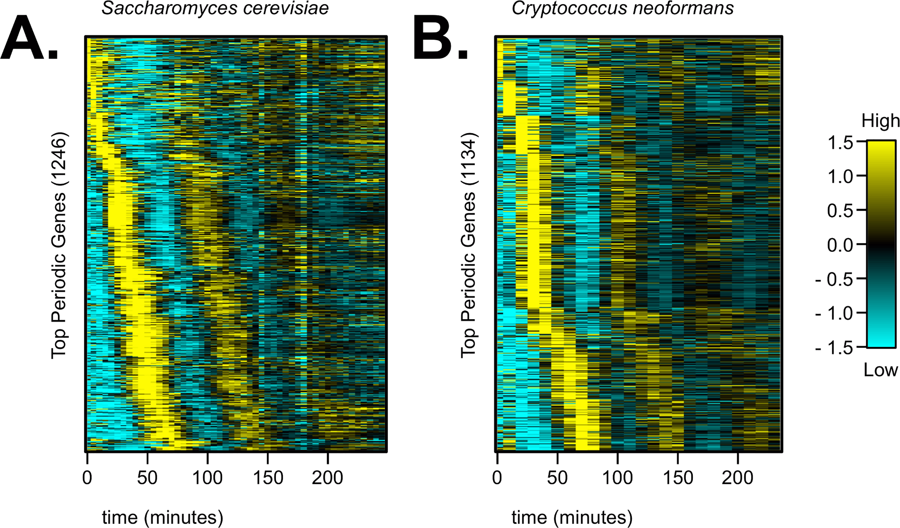
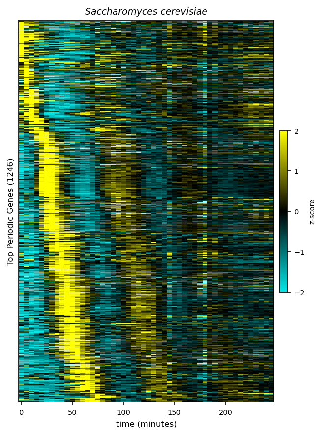

<table style="width: 600px; border: none;" cellpadding="10" align="center">
  <tr>
    <td align="center">
      
    </td>
    <td align="center">
      
    </td>
    <td align="center">
      
    </td>
    <td align="center">
      
    </td>
    <td align="center">
      
    </td>
  </tr>
</table>

# Reproducing Cell-Cycle Transcriptional Heatmaps using GenAI and Python

This project aims to reproduce Figure 2A (the expression heatmap of cell-cycle-regulated genes) from a reference scientific publication using Python and Generative AI (GenAI) assistants. Following modern software engineering standards, the project emphasizes reproducibility, code quality, and structured environments using **Pixi**.

## Project Objective

The goal is to leverage GenAI tools (such as ChatGPT, Claude, or Perplexity) to draft a Python script capable of extracting, processing, and plotting biological data to exactly match the visual and scientific insights of **Figure 2A** from the following paper:

* **Reference Article:** *Investigating Conservation of the Cell-Cycle-Regulated Transcriptional Program in the Fungal Pathogen, Cryptococcus neoformans.* Kelliher *et al.*, PLoS Genetics (2016). [doi:10.1371/journal.pgen.1006453](https://doi.org/10.1371/journal.pgen.1006453)
* **Target:** Figure 2A (Heatmap showing the standardized expression profiles of oscillating/periodic genes ordered by peak expression time).



---

## Usage

To reproduce the heatmap, follow these steps:

1. **Clone the Repository:**

```bash
git clone https://github.com/Essmaw/ia-bioreprod2026-01.git
cd ia-bioreprod2026-01
```

2. **Set Up the Environment:**

To ensure reproducibility, we use **Pixi** to manage dependencies. Install the required packages by running:

```bash
pixi install
```

3. **Run the command:**

```bash
pixi run python src/plot_fig2a.py  --xlsx_path data/pgen.1006453.s002.xlsx --output fig2A.png
```

This command will execute the script to generate the heatmap and save it as `fig2A.png` in the current directory. 



> 💡 **Note:** Ensure that the input Excel file (`pgen.1006453.s002.xlsx`) is correctly placed in the `data` directory as specified in the command.